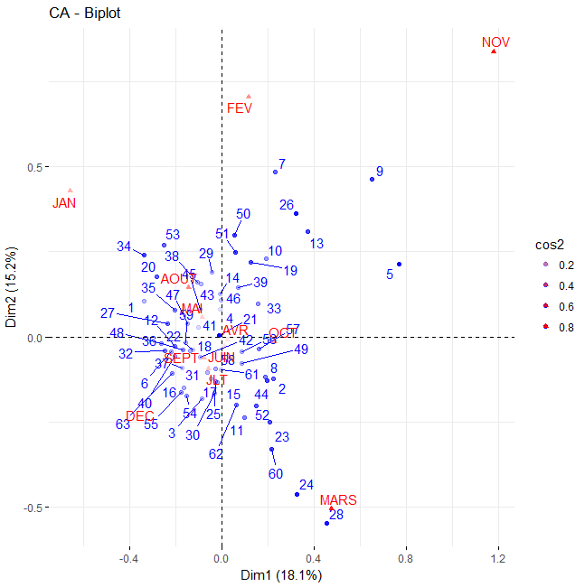
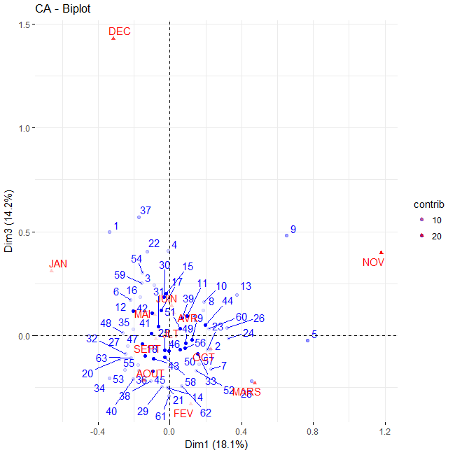
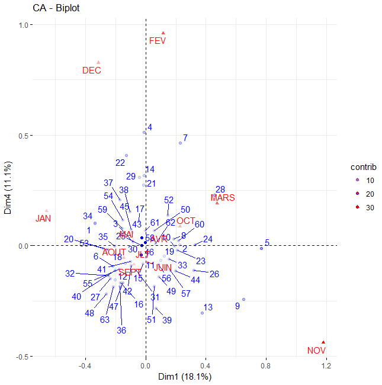
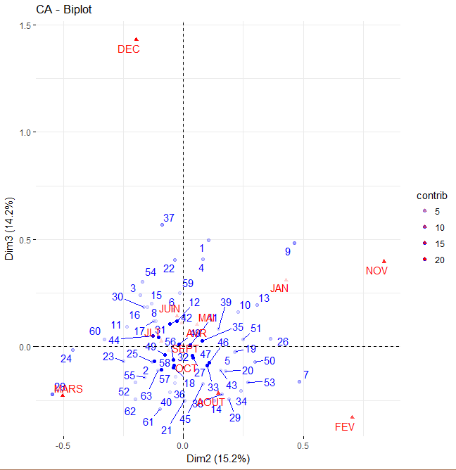
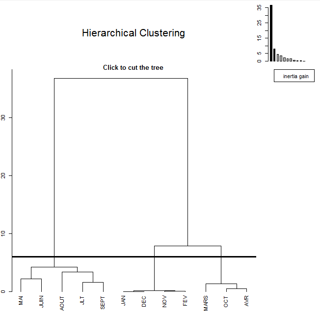
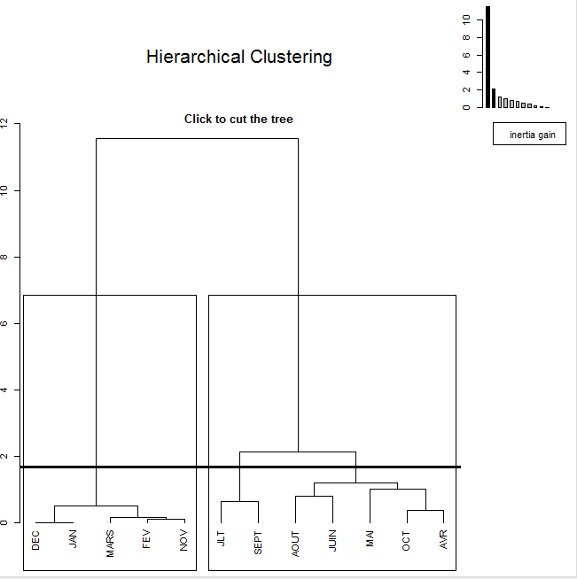
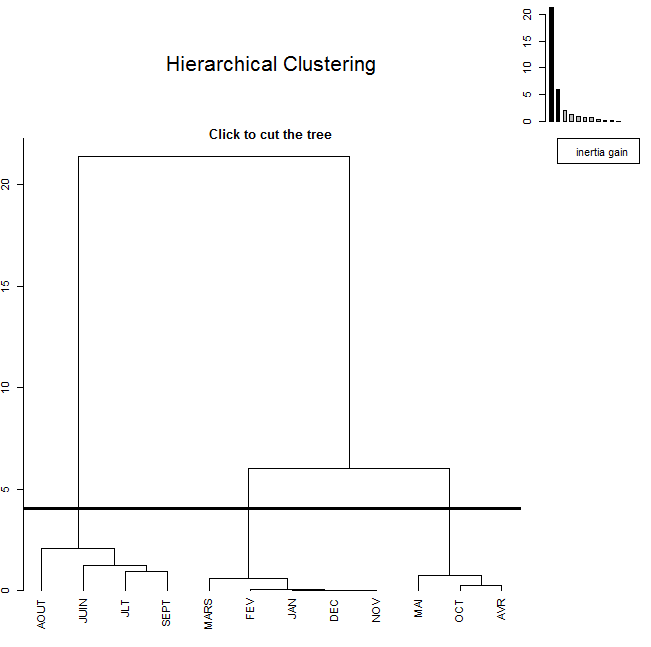

Dans le souci d'analyser la variabilité pluviométrique dans le canton de
Sotouboua, à partir des données pluviométriques de 63 années (1950 à
2016) sur 12 mois, nous proposons une analyse en composante principale
(ACP) dans le logiciel R version 3.5.1. En effet, un ACP est une analyse
statistique permettant de mesurer les liens ou corrélations entre deux
variables quantitatives. Il s'agit ici des variables mois et années.

Pour se faire dans un premier temps nous allons effectuer un test
d'indépendance de Chi-deux. Au vue des résultats du test l'hypothèse
d'indépendance est rejeté (en effet $ X-squared =19838 $, $ df = 682
$, $ p-value < 2.2e-16:X-squared $ est la statistique du test
tendant, df est le degré de liberté p-value est risque de se tromper.)
Une faible valeur de X-squared (proche de zéro ) ou une p-value
supérieur à 0.05 conduit à l'acceptation de l'hypothèse nulle .

Sous hypothèse de dépendance (confirmé par le test de Chi-deux) , nous
allons effectuer l'ACP. L'ACP effectué sur un tableau de contingence $
12X63 $ va répartir toutes l'information apporté par ce tableaux
suivant 11 axes (nommés dim) porteurs d'informations (en pourcentage )
rangé dans l'ordre décroissant. Voici les résultats de l'ACP.

## 1 Valeurs propres

La valeurs propre d'un axe est l'information apporté par cet axes (en
pourcentage).

|        | eigenvalue  | variance.percent | cumulative.variance.percent |
|:------:|:-----------:|:----------------:|:---------------------------:|
| Dim.1  | 0.044698102 |    18.138586     |          18.13859           |
| Dim.2  | 0.037537451 |    15.232779     |          33.37136           |
| Dim.3  | 0.034949159 |    14.182444     |          47.55381           |
| Dim.4  | 0.027232681 |    11.051081     |          58.60489           |
| Dim.5  | 0.021340345 |     8.659958     |          67.26485           |
| Dim.6  | 0.018916474 |     7.676346     |          74.94119           |
| Dim.7  | 0.018165233 |     7.371491     |          82.31268           |
| Dim.8  | 0.013813108 |     5.605389     |          87.91807           |
| Dim.9  | 0.011782020 |     4.781169     |          92.69924           |
| Dim.10 | 0.009295294 |     3.772050     |          96.47129           |
| Dim.11 | 0.008695634 |     3.528707     |          100.00000          |

## 2 Contributions des variables

La contribution est la quantité d'information apportée par chaque
variable pour la construction d'un axe donnée (en pourcentage). On dira
qu'une variable à de bonne propriétés d'un axe si sa valeur propre est
supérieur à la moyenne. Nous avons la contribution des variables années
et celles des variables mois

|         |    **Dim 1**    |  **Dim 2**  |  **Dim 3**  |   **Dim 4**   |  **Dim 5**  |
|:----------:|:----------:|:----------:|:----------:|:----------:|:----------:|
|   JAN   |   6.17592352    | 3.09035197  |  1.751143   | 5.738692e-01  | 6.79473371  |
|   FEV   |   0.47547849    | 20.74205368 |  4.9241520  | 5.321046e+01  | 1.20198685  |
|  MARS   |   23.98124639   | 32.33141863 |  7.0894291  | 6.336977e+00  | 0.03872369  |
|   AVR   |   0.10013889    | 0.01375928  |  2.8764154  | 8.436081e-04  | 21.63784880 |
|   MAI   |   1.77362250    | 0.93548682  |  3.2037271  | 2.630442e-01  | 6.87885058  |
|  JUIN   |   0.02496709    | 0.24308180  |  7.6215066  | 2.627877e+00  | 0.03021054  |
| JUILLET |   1.23009248    | 3.75026446  |  0.3109464  | 2.447244e-02  | 45.40221126 |
|  AOUT   |   8.02820698    | 9.54262954  | 22.6844290  | 1.910337e+00  | 1.19724118  |
|  SEPT   |   2.38999089    | 1.78567105  |  0.1636843  | 4.628532e+00  | 0.40277272  |
|   OCT   |   9.59779695    | 0.04313861  |  0.9304660  | 2.254031e+00  | 9.32247300  |
|   NOV   |   44.62251863   | 26.77274206 |  6.4406346  | 1.010605e+01  | 3.82981942  |
|   DEC   |   1.60001717    | 0.74940210  | 42.0034665  | 1.806352e+01  | 3.26312826  |

Sur chaque axe nous retenons que les mois  dont la contribution est au-dessus de la moyenne (la moyenne vaut $ 1/12 $ soit $ 8.33% $).

Les graphs suivants résument l’ensemble des informations de l’ACP.

*Figure 1 :   Représentation graphique des variables dans le plan 1 (axes 1 et 2) en fonction de leurs contributions*

*Figure 2 :    Représentation graphique des variables dans le plan 2 (axes 1 et 3) en fonction de leurs contributions*

*Figure 3 :     Représentation graphique des variables dans le plan 3 (axes 1 et 4) en fonction de leurs contributions*

*Figure 4 :Représentation graphique des variables dans le plan 4 (axes 2 et 3) en fonction de leurs contributions*

Les graph ci-dessus présentent  les corrélations entre les variables d’une parts et entre les variables et les axes  d’autre part. Dans ces plans  porteurs  de 33.37% de l’information totale (axes 1et 2) nous n’analyserons que les variables éloignées du centre ; celles au centre contribuant faiblement à la formation des deux axes (voir le gradient des couleurs). Cette tendance permettra   de regrouper les mois et années voisin (c’est-à-dire les mois et années ayant les mêmes caractéristiques).  Les mois février, mars, novembre et janvier d’une part et les années `\(1958, 1956,1954, 1962,1975, 1977, 1973, 1972,\)` $ 1969, 2013, 2006, 2003, 2004$   sont fortement corrélés.

Dans l’optique de distinguer les saisons dans le contons de sotouboua nous avons dû réaliser la Classification Ascendante Hiérarchique (CAH) sur l’ensemble des données pluviométrique (1950 -2016) dont voici le dendrogramme :

*Figure 5 : Dendrogramme de l’ensemble de la série*

Un dendrogramme (du grec ancien dendro « arbre », graphein «graver », gramma « petite gravure ») est un diagramme fréquemment utilisé pour illustrer l’arrangement de groupes générés par un regroupement hiérarchique ou hiérarchisant.   

<b>Principe d’un CAH:</b> l’ordre de formation des classes est celui de la proximité minimale à la proximité maximale. Le principe de génération de classes étant basé sur le regroupement progressif des individus (mois) (ou classes d’individus) les plus proches (distance minimale) de sorte que les classes soient les plus homogènes possible (variance intraclasse minimale) et les plus distantes possible deux à deux (variance interclasse maximale). Ici la distance entre deux mois est la différence entre les hauteurs (tiges) en valeur absolue. Dans ce dendrogramme, la hauteur des classes matérialise l’ordre de formation des classes. Le nombre de classe à retenir est celui qui à la fois, minimise la variance intra-classe et maximise la variance interclasse c’est-à-dire de sorte que les mois d’une même classe soit le mois distinguable (séparable) possible et ceux issues de deux classes distinctes le plus distinguable possible. Nous allons considérer dans notre contexte les classes pour les saisons.  En observant le dendrogramme,  nous pouvons distinguer 3 types de classes (saisons) :

- Une première classe englobant les mois  sèche : novembre, décembre, janvier et février,
- Une deuxième classe des mois plus ou moins humide : mars, octobre et avril,
- Et une troisième classe des mois humides : mai, juin, juillet, août et septembre.

Nous pouvons de même observer que la deuxième classe est plus proche de la première que de la troisième classe.

Nous avons de bonne raisons de croire que de nos jours la période favorable à l’agriculture dans le canton de Sotouboua est moins longue que celle des années 60.
Pour soutenir notre hypothèse nous avons effectué deux CAH ; l’un sur l’ACP réalisé sur les données pluviométrique du dit canton des années 1950-1970 et le second sur  l’ACP réalisé sur les données pluviométrique du dit canton des années 1982-2016 dont voici les dendrogrammes :

*Figure 6 : Dendrogramme des données des années 1950-1970*

Nous distinguons 3 types de classes :
- Une première classe englobant les mois  sèche : novembre, décembre, janvier février et mars,
- Une deuxième classe des mois  humide : mai, juin, avril, août et octobre,
- Et une troisième classe des mois  très humides : juillet, septembre. 

Nous pouvons de même observer que la deuxième classe est plus proche de la troisième que de la première classe. Sous hypothèse que la variance interclasse doit être maximale que possible, nous pouvons joindre les deux dernières classes.

*Figure 7 : Dendrogramme des données des années 1950-1970*

Nous distinguons 3 types de classes :

- Une première classe englobant les mois  sèche : novembre, décembre, janvier février et mars,
- Une deuxième classe des mois plus ou moins humide : mai, avril, et octobre,
- Et une troisième classe des mois  très humides : août, juin, juillet et septembre. 

Nous pouvons de même observer que la deuxième classe est plus proche de la que première de la troisième classe. 

